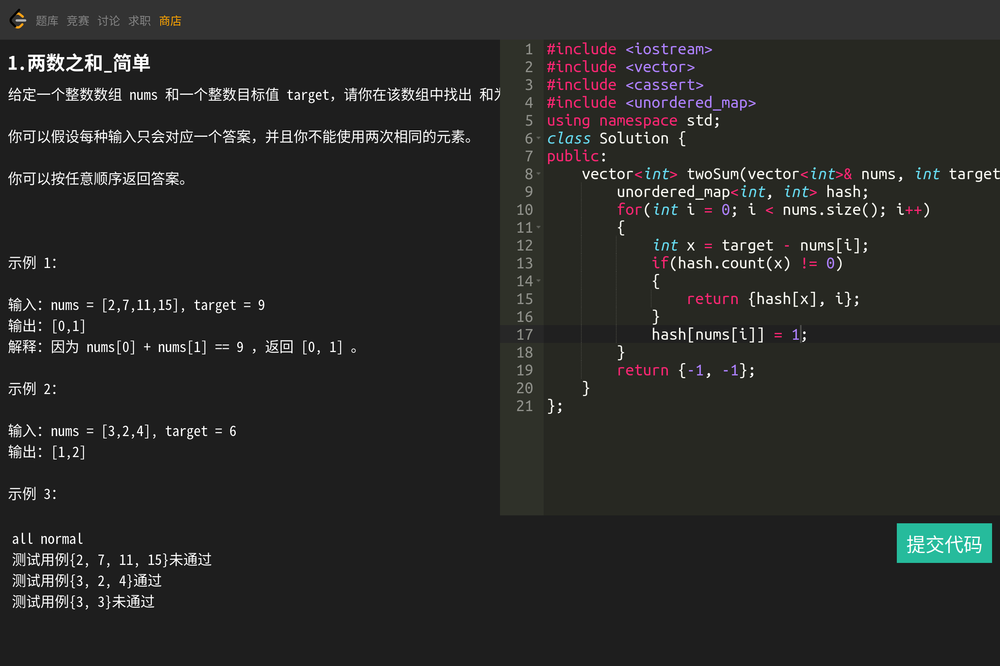

# 负载均衡的Online judge平台

## 模块
### 后端
#### 1. 题目存储
采用mysql数据库存储，通过odb实现语言到库的映射，并支持通过编写题目描述、题目预设代码、题目测试代码文件的方式直接录入数据库
#### 2. 序列化
通过Jsoncpp完成前后端交互时的信息传输以及编译运行模块和判题模块的信息交互
#### 3. 判题与结果返回
通过进程程序替换exec函数 + 多进程实现；通过重定向获取输出信息到临时文件中。
#### 4. 负载均衡的实现方式
将时间作为种子生成随机数，挑选主机；通过轮询 + 故障重试的方式完成服务的调用
#### 5. 链接
根据最基本判题功能的实现特点，采取httplib作为http链接客户端，不需要维持长链接，后期可能考虑有需要服务的话，通过websocket维持长链接
#### 6. 题目运行时的资源闲置
通过系统调用setrlimit完成对cpu时间和内存的限制
#### 7. 服务器设计思想
采取MVC模式，分模块完成
1. 与odb配合，完成与mysql的交互（model）
2. 将交互结果与ctemplate配合渲染到模板网页上（view）
3. 与httplib配合完成对各个功能请求的处理，调用模块，返回结果（control）
### 前后端交互
#### 1. 数据库与前端
通过ctemplate将数据库中存储的题目信息，渲染到预设好的题目列表和单个题目作答的页面上，通过httplib的POST方法将处理好的数据返回前端
### 前端
#### 1. 页面
通过html和css完成页面设计，应用一部分jsvascript于ajax完成前后端交互的内容
#### 2. 代码编辑区域
通过ace编辑器完成代码框，支持语法题诗、语法高亮
#### 3. 发送请求
通过ace编辑器收集到代码后，通过ajax向后端发送POST请求处理编译服务，回显到网页上，完成编译过程
### 测试
postman测试 + 浏览器直接调试
### 其他
采用spdlog作为日志器，gflags用于指定运行端口